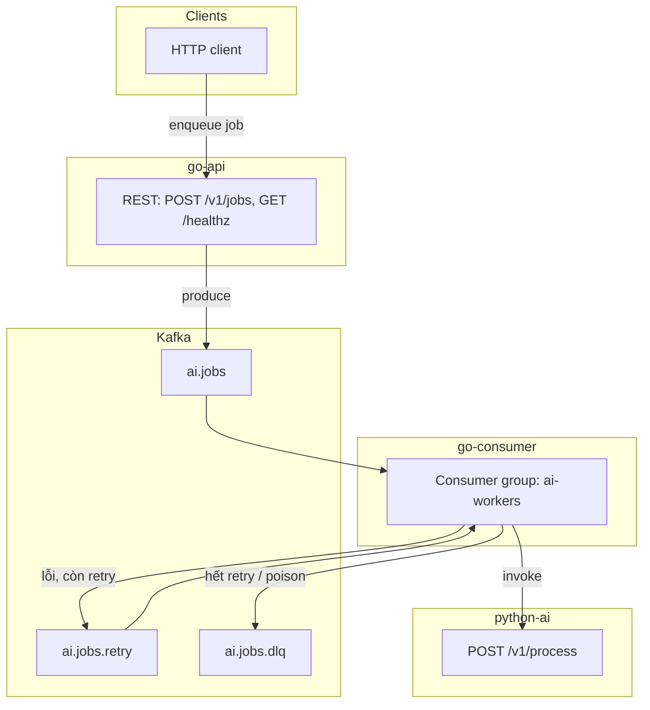

# Distributed AI query system

Hệ thống demo: client gọi **Go API** để đưa job vào **Kafka**, **Go consumer** xử lý bất đồng bộ, gọi **Python AI** (FastAPI). Có **retry topic** và **DLQ** khi xử lý lỗi hoặc vượt số lần thử.

## Kiến trúc



Nguồn sơ đồ (Mermaid) trong repo: [`docs/architecture.mmd`](docs/architecture.mmd) — khi đổi sơ đồ, cập nhật cả khối trên và file `.mmd` cho đồng bộ. File `docs/architecture.svg` không nằm trong git (artifact); xuất SVG cục bộ (Docker):

```bash
docker run --rm -v "$(pwd)/docs:/data" minlag/mermaid-cli:11.4.0 \
  -i /data/architecture.mmd -o /data/architecture.svg -b transparent
```

Luồng tóm tắt:

1. Client gửi `POST /v1/jobs` tới **go-api** → message JSON ghi vào topic **`ai.jobs`** (header `x-retry-count`).
2. **go-consumer** đọc **`ai.jobs`** và **`ai.jobs.retry`**, gọi **python-ai** `/v1/process`.
3. Thành công → commit offset Kafka.
4. Thất bại → tăng retry, backoff, publish lại lên **`ai.jobs.retry`**; sau **`MAX_RETRIES`** → ghi **`ai.jobs.dlq`** (kèm header lý do).

## Yêu cầu

- [Docker](https://docs.docker.com/get-docker/) và Docker Compose v2

## Chạy bằng Docker Compose

Trong thư mục gốc của repo:

```bash
docker compose up --build -d
```

Hoặc:

```bash
make up
```

Các dịch vụ và cổng (máy host):

| Dịch vụ     | Mô tả              | URL / cổng        |
|------------|--------------------|-------------------|
| **api**    | Go API             | http://localhost:8080 |
| **python-ai** | FastAPI (stub AI) | http://localhost:8000 |
| **kafka**  | Broker (từ host)   | `localhost:9094`  |

Dừng stack:

```bash
docker compose down
# hoặc: make down
```

Xem log API, consumer, AI:

```bash
docker compose logs -f api consumer python-ai
# hoặc: make logs
```

## Thử nhanh API

Tạo job (trả về `202 Accepted` và `job_id`):

```bash
curl -sS -X POST http://localhost:8080/v1/jobs \
  -H 'Content-Type: application/json' \
  -d '{"query":"xin chào"}'
```

Kiểm tra sức khỏe:

```bash
curl -sS http://localhost:8080/healthz
curl -sS http://localhost:8000/healthz
```

## Demo retry / DLQ

Trong **python-ai**, nếu chuỗi `query` chứa `fail` (không phân biệt hoa thường), service trả **503** để giả lập lỗi AI. Consumer sẽ retry qua **`ai.jobs.retry`**; sau khi vượt ngưỡng (mặc định `MAX_RETRIES=5` trong `docker-compose`) message vào **`ai.jobs.dlq`**.

```bash
curl -sS -X POST http://localhost:8080/v1/jobs \
  -H 'Content-Type: application/json' \
  -d '{"query":"this will fail"}'
```

## Build Go trên máy (tùy chọn)

Cần Go 1.22+:

```bash
make tidy
make build
```

Binary: `bin/api`, `bin/consumer`. Khi chạy ngoài Docker, đặt `KAFKA_BROKERS` trỏ tới broker (ví dụ `localhost:9094` nếu Kafka đang map cổng như trong Compose).

## Cấu trúc thư mục

- `go-api/` — HTTP API + Kafka producer  
- `go-consumer/` — Kafka consumer + retry/DLQ  
- `python-ai/` — FastAPI stub  
- `docs/` — sơ đồ kiến trúc (`architecture.mmd`; `architecture.svg` tạo cục bộ nếu cần)  
- `docker-compose.yml` — orchestration  
