# Distributed AI query system

Hệ thống demo: client gọi **Go API** để đưa job vào **Kafka**, **Go consumer** xử lý bất đồng bộ, gọi **Python AI** (FastAPI). Có **retry topic** và **DLQ** khi xử lý lỗi hoặc vượt số lần thử.

## Kiến trúc



Luồng tóm tắt:

1. Client gửi `POST /v1/jobs` tới **go-api** → message JSON ghi vào topic **`ai.jobs`** (header `x-retry-count`).
2. **go-consumer** đọc **`ai.jobs`** và **`ai.jobs.retry`**, gọi **python-ai** `/v1/process`.
3. Thành công → ghi **`job_results`** vào **Postgres** (schema từ `scripts/init-db.sql`), rồi commit offset Kafka.
4. Thất bại → tăng retry, backoff, publish lại lên **`ai.jobs.retry`**; sau **`MAX_RETRIES`** → ghi **`ai.jobs.dlq`** (kèm header lý do).

## Yêu cầu

- [Docker](https://docs.docker.com/get-docker/) và Docker Compose v2

## Chạy bằng Docker Compose

Trong thư mục gốc của repo:

```bash
docker compose up --build -d
```

Hoặc:

```bash
make up
```

### Demo nhanh (sau khi stack đã `up`)

Gửi một job và chờ tới khi `GET /v1/jobs/{id}` trả `completed` (in JSON đẹp bằng `python3`):

```bash
make demo
# hoặc: ./scripts/demo.sh
```

Biến môi trường (tùy chọn):

| Biến | Mặc định | Ý nghĩa |
|------|----------|---------|
| `API_URL` | `http://localhost:8080` | Base URL go-api |
| `QUERY` | `xin chào demo` | Nội dung gửi tới AI |
| `TIMEOUT_SEC` | `60` | Thời gian chờ tối đa (giây) |
| `SLEEP_SEC` | `0.3` | Khoảng cách giữa các lần poll |

Ví dụ:

```bash
QUERY="hello from script" TIMEOUT_SEC=120 ./scripts/demo.sh
```

Các dịch vụ và cổng (máy host):

| Dịch vụ     | Mô tả              | URL / cổng        |
|------------|--------------------|-------------------|
| **api**    | Go API             | http://localhost:8080 |
| **python-ai** | FastAPI (stub AI) | http://localhost:8000 |
| **postgres** | PostgreSQL 16    | `localhost:5432` (user/db: `app` / `app`) |
| **kafka**  | Broker (từ host)   | `localhost:9094`  |

Dừng stack:

```bash
docker compose down
# hoặc: make down
```

Xem log API, consumer, AI:

```bash
docker compose logs -f api consumer python-ai
# hoặc: make logs
```

## Thử nhanh API

Tạo job (trả về `202 Accepted` và `job_id`):

```bash
curl -sS -X POST http://localhost:8080/v1/jobs \
  -H 'Content-Type: application/json' \
  -d '{"query":"xin chào"}'
```

**Xem kết quả** (đọc từ Postgres sau khi consumer xử lý xong):

- `GET /v1/jobs/{job_id}` — nếu chưa có dòng trong `job_results` thì trả `"status": "pending"`; khi đã ghi DB thì `"status": "completed"` kèm `query`, `result`, `created_at`.

```bash
# Giả sử đã có biến JOB_ID từ bước POST (hoặc copy từ JSON trả về)
curl -sS "http://localhost:8080/v1/jobs/${JOB_ID}"
```

Chờ kết quả bằng vòng lặp (cần [jq](https://jqlang.org/)):

```bash
JOB_ID=$(curl -sS -X POST http://localhost:8080/v1/jobs \
  -H 'Content-Type: application/json' \
  -d '{"query":"xin chào"}' | jq -r .job_id)

until [ "$(curl -sS "http://localhost:8080/v1/jobs/${JOB_ID}" | jq -r .status)" = "completed" ]; do
  sleep 0.3
done
curl -sS "http://localhost:8080/v1/jobs/${JOB_ID}" | jq .
```

*Nếu job lỗi hết retry và vào DLQ, bản ghi không được tạo trong `job_results` — API vẫn trả `pending`.*

Kiểm tra sức khỏe:

```bash
curl -sS http://localhost:8080/healthz
curl -sS http://localhost:8000/healthz
```

## Demo retry / DLQ

Trong **python-ai**, nếu chuỗi `query` chứa `fail` (không phân biệt hoa thường), service trả **503** để giả lập lỗi AI. Consumer sẽ retry qua **`ai.jobs.retry`**; sau khi vượt ngưỡng (mặc định `MAX_RETRIES=5` trong `docker-compose`) message vào **`ai.jobs.dlq`**.

```bash
curl -sS -X POST http://localhost:8080/v1/jobs \
  -H 'Content-Type: application/json' \
  -d '{"query":"this will fail"}'
```

## Build Go trên máy (tùy chọn)

Cần Go 1.22+:

```bash
make tidy
make build
```

Binary: `bin/api`, `bin/consumer`. Khi chạy ngoài Docker, đặt `KAFKA_BROKERS` và `DATABASE_URL` cho **api** (đọc kết quả) và **consumer** (ghi kết quả) tương ứng Compose.

**Lưu ý:** `scripts/init-db.sql` chỉ chạy khi Postgres khởi tạo volume **lần đầu**. Đổi schema trên volume cũ cần migration thủ công hoặc tạo volume mới (`docker compose down -v` sẽ xóa dữ liệu).

## Cấu trúc thư mục

- `go-api/` — HTTP API + Kafka producer  
- `go-consumer/` — Kafka consumer + retry/DLQ  
- `python-ai/` — FastAPI stub  
- `docs/` — sơ đồ kiến trúc (`architecture.mmd`, `architecture.svg`)  
- `scripts/init-db.sql` — khởi tạo bảng Postgres (mount vào container `postgres`)  
- `scripts/demo.sh` — demo POST job + poll kết quả (`make demo`)  
- `docker-compose.yml` — orchestration  
